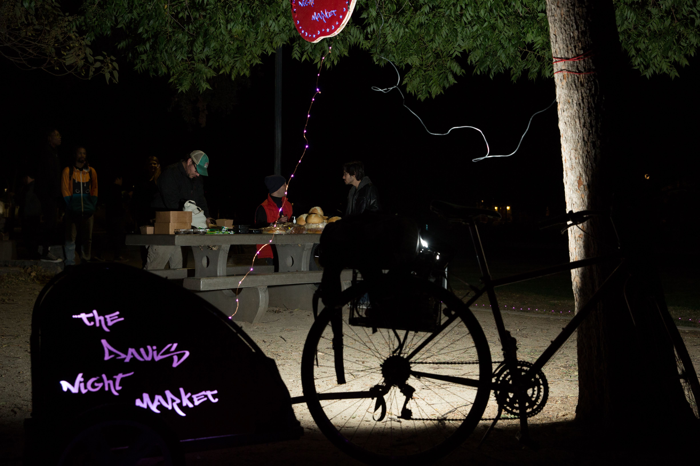
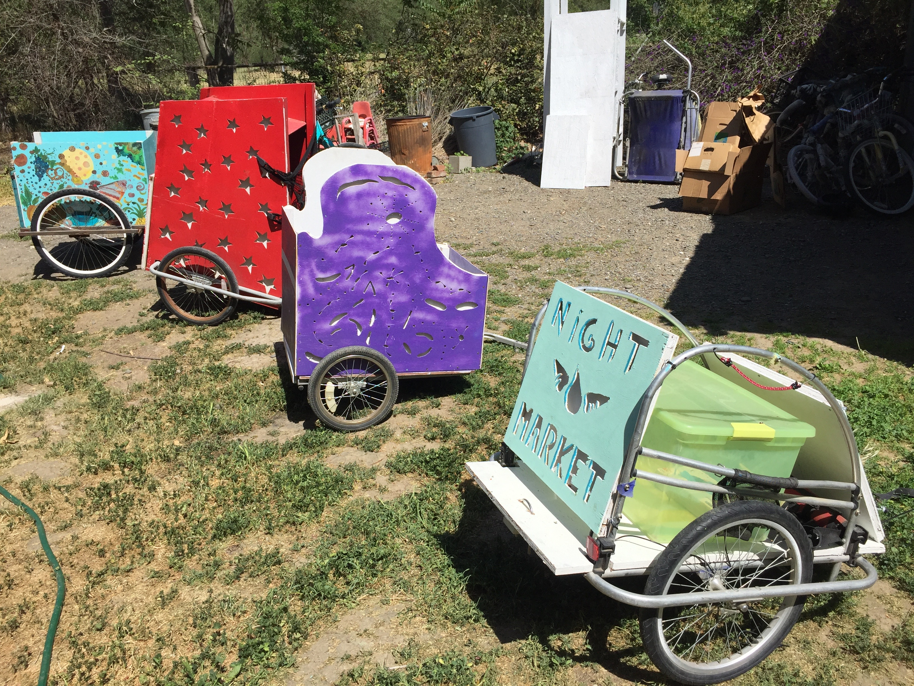
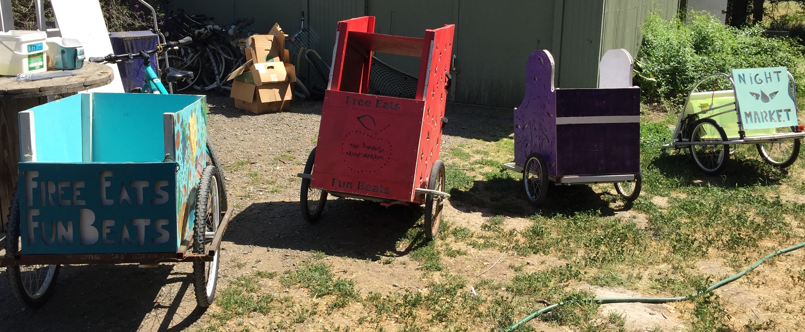
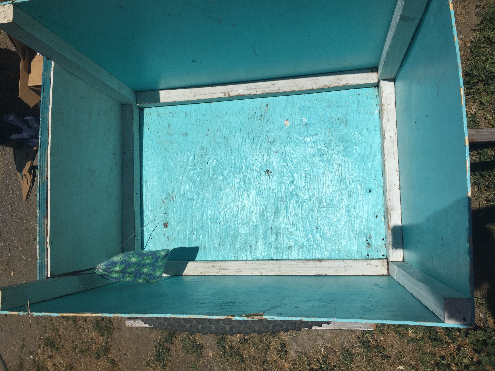
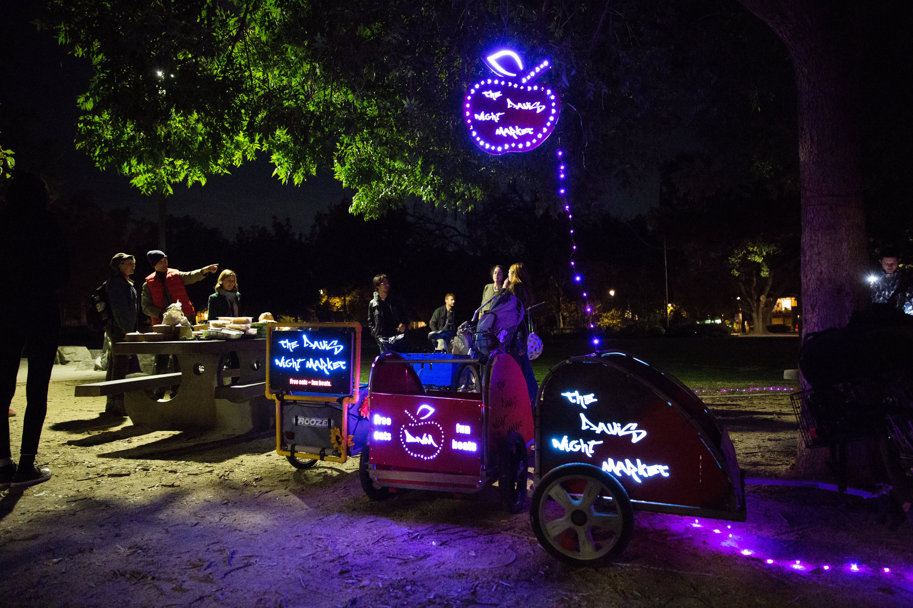

# **RE-BUILD A USED BIKE TRAILER** 

</h4>

</h4>

At Night Market, we generally repurpose and re-vamp second-hand bike trailers by adding: 

* a wooden box: this provides a sturdier frame and can allow increased food capacity.

* LED-lit signs and lights: improves the visibility of night market riders, thus increasing their safety during night-time food pick-ups and also increasing recognizability in the community. 

## YOU NEED 

### Materials 

* bike trailer frame

* LEDs: 

- DAYBETTER Led Strip Light Waterproof 600leds 32.8ft 
- 10m Waterproof Flexible Color Changing RGB SMD 5050 600leds LED Strip Light Kit with 44 Keys IR Remote Controller and 12V Power Supply

* Paint: exterior water-proof. 
* Primer: all purpose. 
* Mix of painting supplies such as rollers, trays, painters tape
* Plywood: Sande plywood (¼ inch for light panels, ½ for the rest)
* Wood (2x4): 2 in. x 4 in. x 96 in. Premium Kiln-Dried Whitewood Stud. for the inside of the light panels, and structure re-enforcement.
* Measuring tape
* Wood glue
* Wood filler
* Batteries: TalentCell Rechargeable 12V 6000mAh/5V 12000mAh DC Output Lithium Ion Battery Pack for LED Strip and CCTV Camera, Portable Li-ion Battery Bank with Charger, Black (Multi-led Indicator)
* mix of screws and bolts, different sizes
* Zip ties

### Tools
* Drill
* JigSaw
* Circular saw

## HOW TO

### **Recover a used bike trailer**

You can usually find used bike trailers on craiglist, facebook marketplace or buy nothing facebook groups. Once your night market chapter becomes know in your community, bike trailers will come to you :) 

* the original trailer’s structure/design will influence the amount of materials you have to use and how much work it's going to take to build the new one.

* the capacity and weight it's able to carry will vary by maker. IF you can, it's good to check the weight it's designed to carry and take it into account when you plan what you will use this trailer for and the materials. A good brand to go for is Burley, they are sturdy, well made and can carry a decent amount of weight. 

### **Design the trailer’s structure** 

Depending on the metal frame of the recovered trailer, and the planned use the trailer, the design may vary. 

#### **Basic structure**

Things to consider:

* LED-lit sides will need double wood panels, that will “sandwich” the LEDs inside (for example, if there are 2 lateral panels, you will need to cut out 4 identical pieces). These will increase the weight of your trailer considerably.

* If you want your trailer to be as lightweight as possible, consider minimizing areas with wood, using nets or leaving the metal frame structure bare. 

* The shape of your trailer should be as aerodynamic as possible.

* Check the weight your frame is designed to load, and take that into account when you decide on the materials for your design. The intended cargo can vary, but usually ones you will find for free are dog trailers for kids or dogs that weigh around 80-125 lb (around 45 kg). 

* Remember to ensure easy access for loading and unloading the food (ideally the back panel will be shorter can be moved on hinges)
  

#### Lateral panels

The height of the lateral structure will define cargo capacity. 

We have tried out 3 types of lateral panels: 

* **LED-lit wood side panels**: this is the most visually pleasing but also heavy (in the picture, the red and purple trailers)
    
* **wooden side panels**: lighter than the LED signs but still sturdy. you can paint these to make them visually pleasing (in the picture, the blue trailer)
    
* **metal frame of the trailer, nothing added**: lightest most minimalist version, but will probably need to carry a plastic tub or cardboard box to contain the food (in the picture, the trailer furthest to the right)

</h4>

</h4>
  

#### Front and back panels

typically shorter, and must allow easy access to the food inside the trailer. If you want your trailer to have only one illuminated LED sign, the back panel is a good choice

</h4>

</h4>
  

#### Bottom panel

thicker wood is recommended, and must adjust to the trailer metal frame, at least ½ inch plywood. 
  

### **Building steps** 

1. Disassemble the recovered trailer, leaving just the metal structure

</h4>

</h4>

2. Cut pieces of plywood for the lateral, front, back, and bottom panels according to your design, using the circular saw.

</h4>

</h4>

3. You will sometimes need to cut some gaps into the panels to fit them around the metal frame.  This will often be necessary for the bottom panel, especially if the frame has bends towards the ground or there are metal arches in the structure. 

</h4>

</h4>

4. Cut pieces of 2X4 wood to support your structure. You can cut each one in half to make your individual beams. You will probably need 4 beams to support the lateral and front and back panels and also 4 beams along the bottom to attach the lateral panels to the bottom (floor) panel.

</h4>

</h4>

5. Cut 1 or 2 long pieces of wood that are a bit longer than the bottom panel (probably 3-4 inches are enough). You can use this to attach the floor panel to the metal trailer frame by drilling a long thick bolts through both the bottom beam and the floor, or using U-bolts for the same purpose. 
  
</h4>

</h4>

6. Prime all wood panels and beams

7. Paint all wood panels and beams

8. Assemble the painted and primed pieces using appropriately sized screws and bolts. 

The beams and panels should look something like this: 
  
</h4>

</h4>
  

**and you're done!!**

    

</h4>

</h4>
    

How to video coming soooon :) 

# **LED SIGN**

How to video coming soooon :) 
