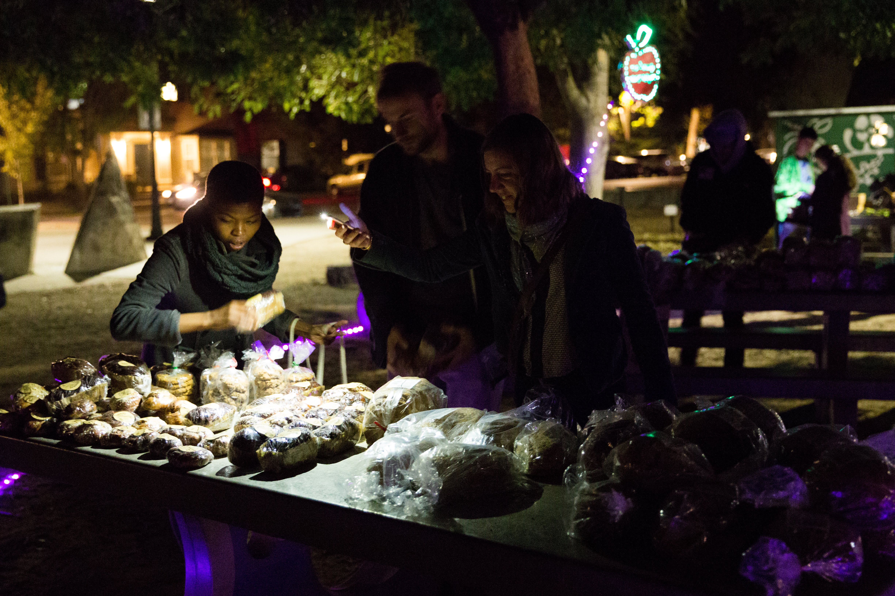
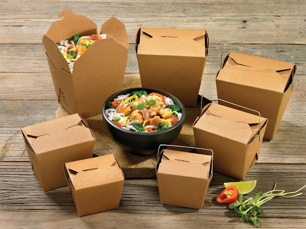
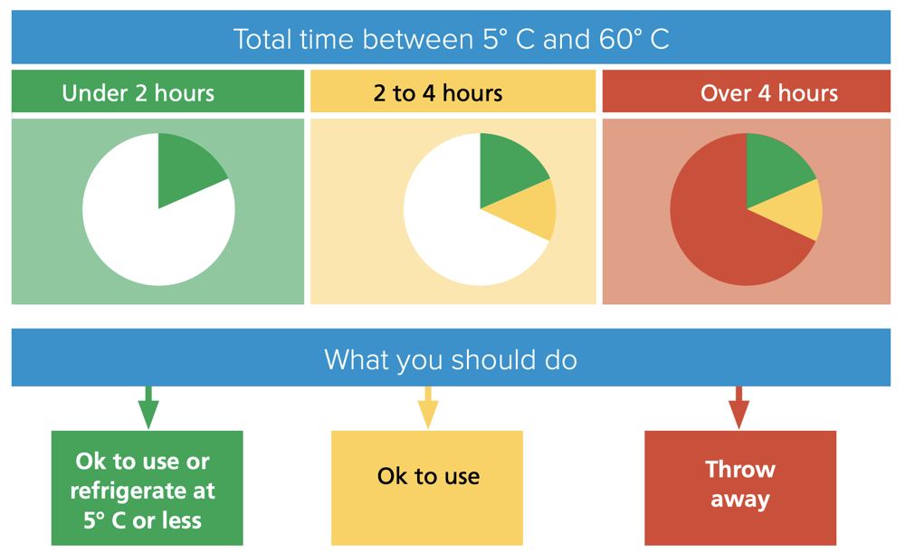
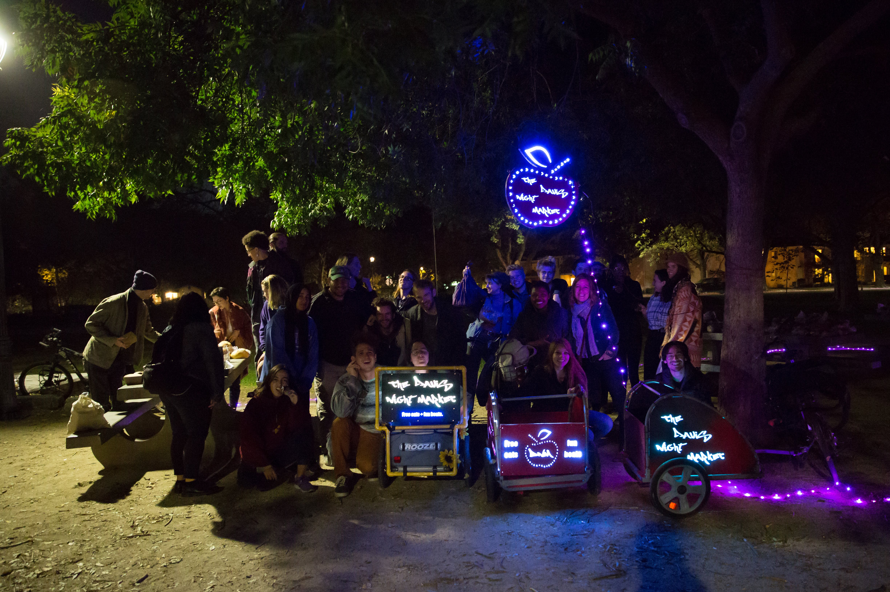

# **FOOD RECOVERY** 

## YOU NEED 

### Materials

**Equipment, utensils and food containers must all be food-grade!!**

* Boxes: carboard, food-grade
* Hand sanitizer
* Utensils: store these in a plastic bag or a ziploc and clean them when you're done

  * spoons
  * ladles
  * tongs
* Sharpie
* Paper towels/napkins 
* Table cover 

COVID precautions require

* Gloves
* Mask 

### Team
Recommended 2 people per location, to minimize the time spent distributing food into boxes. It is recommended to have the same people performing the same pick-ups to establish rapport with the establishment’s employees. In addition, calling the donor business in advance to ask if they have anything to offer is good practice.

### Transport 

At Night Market we're committed to sustainability: we believe that burning fossil fuels to prevent food waste from emitting methane in a landfill is something of an oxymoron. That's why, where local bike infrastructure allows, we perform all food pick-ups using bike trailers. To learn how to build your own LED-lit bike trailer, check out the section on [how to build night market stuff ](https://davisnightmarket.github.io/diy/build) 

	
## HOW TO

### **How to find donors**

Check out the section on [restaurant recruitment]()

### **How to choose a time and place for the event**

### **How to serve food**
 

If required by the business, call previously to ask if they have donations. 

1. Contain your hair, put on gloves and apply hand sanitizer

2. Portion food into individual boxes 

    * using food-grade utensils
    * the boxes should be food-grade and compostable
    
   
  
3. Label the boxes with the contents

    The more detail, the less impulse people will have to open the boxes to see what is inside, which is against the health code. 

4. Clean the space 

    Important in order to maintain the goodwill of the donor businesses. 

5. Load your bike trailer and go! :) 

6. Unload at distribution location

7. Put on gloves and apply hand sanitizer again 

8. Serve the food to the customers

    * consumers should not open boxes, if they do, they have to keep them. 
    * food must be covered and protected 
    
  
#### COVID precautions

To avoid causing aglomerations of people around the food, our current system is to spread the food out on a long wall, where night market volunteers stand on one side and the consumers line up on the other. Then consumers approach the wall one by one, volunteers describe and illuminate the food items and hand the desired items to the consumer individually, using tongs and wearing gloves. 

### **How to comply with CA health permit requirements**

The Night Market event shouldn't last more than 4 hours, as that is the maximum time perishable food can be outside of refrigeration, and also the maximum time food can be served outdoors. 

Our Davis Night Market lasts 2 hours, from 9-11PM, as this is the time most businesses close and we recover food at closing time. 

#### **Do we need food safety training?**

Nope, it's not required, you just need to follow Best Management practices (BMP). Here's a summary of those provided by our own Yolo County (<a href="docs/LSCFO_flowchart.pdf" target="_blank">BMP </a>), but I'm going to go over the key aspects below. 

#### **Where can food be served?** 

Outdoors **for up to 4h a day**.

#### **What food can be served?** 

Everything (including expired food) 

**Exceptions** 

* Cooked food from unregistered home kitchens
  - "microenterprise" home kitchens are allowed (see [Foodnome](https://foodnome.com/))
  - commercially pre-packaged foods, baked goods are allowed.

* Salvage operations (So i guess no dumpster diving treasures :( ) 

* Expired baby food and infant formula. 

#### **Food storage**

THIS IS IMPORTANT !!!

**Potentially hazardous food (PHF)**: (i.e., deli meats, dairy products, cooked meats, cooked rice, cooked vegetables, etc.) are perishable and must be kept at 41°F or below.  They can leave cold storage for: 

  - up to 30 minutes for transport
  - up to 2 hours for active preparation or portioning
  - up to 4 hours at a time in total. **After 4h they should be served immediately or dumped.**
  

  

# **COMMUNITY** 

Building community is one of the goals of Night Market. Food brings people together, and at Night Market we seek to welcome folx from all walks of life. Making the redistribution of donated food an enjoyable experience where we can gather, get to know each other and share a meal helps alleviate the stigma associated with food insecurity and free things (because capitalism).

Talking with and showing love to strangers might be the most important part of Night Market; people are often not just hungry for food but for company, and this was especially clear during the pandemic. 

## YOU NEED 

### Materials

* Speaker

 For music!!
 
* LED lights

People will see the event at night and creates a vibe

### Team

It's helpful to have "greeters" or "welcomers", that is, team members with the specific role of engaging with the community apart from those serving the food. 

## HOW TO

PARTY!!

</h4>

</h4>

# **DONOR RECRUITMENT**

## HOW TO

Make a database of all possible donors. Include:

* closing time
* contact (email/phone of establishment)
* name of manager
* when manager's in the establishment
* status of contact (have you emailed them, have you gone in person, what did they say)
* if they've agreed to donate or not

### email 

* Emails should be sent from the oficial night market email. 

* Link your website or social media to show legitimacy.

Here's an email template:

Dear (contact name):

This is (your name), (your role) of the [insert your location] Night Market. I’m contacting you to invite your (restaurant/grocery store/bakery) (name of establishment) to participate in our food recovery program. We are a non-profit organization that has been active in Davis since 2019, reducing food waste and food insecurity in our community. We recover food that would otherwise go to waste from various businesses in Davis at closing time, and immediately take it to Central Park to redistribute it freely to those in need.

We currently hold a Food Service permit from [insert your location] County that allows us to distribute pre-cooked food items, as well as produce and non-perishables. All donations are legally covered by the Federal Good Samaritan Food Donation Law of 2018, protecting the donating business. All you have to do is give us a time and have your left-overs ready for us, and we’ll show up and do the rest. Our volunteers are in charge of portioning the food into compostable containers and transporting it to the [insert your location] using bike trailers, because, yes, we also strive for making our activities zero emissions!

During the pandemic we have had an increase of people seeking our service and are looking to increase our offerings. Do you want to join the [insert your donors] in helping your community and the environment? It’s easy!
Currently, we hold our events four nights a week (Monday through Friday), and we can accommodate one or all of these nights.

Looking forward to hearing from you! (your name)

### visit establishments in person 

#### YOU NEED 

* <a href="docs/liability_flowchart.pdf" target="_blank">**liability flow chart** </a> 
* marketing flyer: with email and website (to look legit)
* copy of the health permit 

#### HOW TO 

Ask to speak to the manager. Always make a good first impression

Template of in person pitch: 

Hi, my name is [___________] , may I speak to the restaurant owner? I am with the Davis Night Market and our non-profit organization recovers leftover food at the end of the night from restaurants around town to reduce waste, and feed the people in need. We are partnered with the Yolo County Food Bank and UC Davis and received our permit from Yolo County. I just wanted to ask you, what do you do with the leftovers once your restaurant closes? 

(restaurant owner answers) 

I wanted to extend this opportunity to you to partner with us and join other restaurants in reducing waste on your end, and letting us do the work in packaging the leftovers, and feeding our people right here in Davis. As an exchange, we will assist with increasing your Yelp Reviews along with the opportunity to use this as a tax write off. Let me go over the liability flowchart with you 

(show restaurant owner how this flowchart works)

## liability

Here's a handy <a href="docs/liability_flowchart.pdf" target="_blank">**LIABILITY FLOW CHART** </a> to assuage donor's fears regarding liability. For more info check out our section on [liability](https://davisnightmarket.github.io/diy/legal#liability) 

## donor FAQs

DO YOU HAVE A PERMIT? 

Yes, we do! We received our permit from Yolo County as well as an event permit from the city of Davis.

UNDER WHAT CATEGORY LEVEL ARE YOU?

We are under category 2 of LSCFO (limited service charitable feeding operation) where we only accept the prepared foods.

AM I GOING TO BE LIABLE?

No, you will not be liable! You are protected by the Federal Good Samaritan Food Donation Act (AB-1219), which says you can’t be sued for giving away food to a non-profit. 

I WOULD LIKE TO USE THIS DONATION OPPORTUNITY AS A TAX WRITE OFF:

You sure can! Please email us at nightmarket@freedge.org 

WHO DOES THE PACKAGING? I DO NOT WANT MY OWN WORKERS TO PACKAGE:

Not to worry! Our volunteers will do all the work in packaging and you do not have to lift a finger on your end.

WHO PROVIDES THE PACKAGING BOXES? THIS WILL CUT INTO MY PROFITS IF I PROVIDE MY BOXES:

Nothing will cost you! We provide our own small package boxes during this process, however, if you want to use your own packaging to promote your brand, you may do so.

I DONATE FOOD ALL THE TIME, WHY SHOULD I DONATE WITH YOU?

Donating to us feeds our friends in the community. Not only does your contribution help them, but we are also helping you eliminate food waste at the end of the day. Composting can be very expensive, we are helping you eliminate that extra leg work to do that.

WHAT ENSURES THAT YOUR NONPROFIT IS LEGITIMATE?

We are a sister npo to Freedge and are partnered with the Aggie Compass, an initiative of UC Davis, Food Recovery Network, a student organization at UC Davis, the UC Davis Pantry, as well as Land&Ladle.

HOW MUCH OF A COMMITMENT DO YOU NEED FROM US?

We hope to collect food every day of the week.

# **VOLUNTEER RECRUITMENT**

## volunteer training process

1. Visit a night market event, assisting with setup, on nights staffed by one of the volunteer trainers. Trainers will outline the various types of assistance that is needed. Different roles new volunteers could be interested in include:

* food pick-up
* restaurant recruiting
* social media
* build

2. Get trained on how to hook a bike trailers to your bike, orient with the items needed (where all the materials needed for food recovery are located), and have a safety check completed on your bike. Contact bike team.  

3. Shadow a pick up with one of the pick-up team members, retrieving a bike trailer (and items) from HQ as needed. 

4. Figure out where you can be most helpful. What nights, what efforts, and what else you are able to help out with. Communicate with the volunteer trainers via email or text. 

Methods of communication though volunteer training: 

* First, email/text. 
* Second, Slack, added after they completed a shadow night. 

## methods of recruitment 

* Messages of interest on social media 

* Messages of interest by email, through website, flyers...

