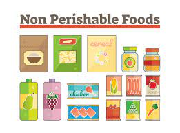
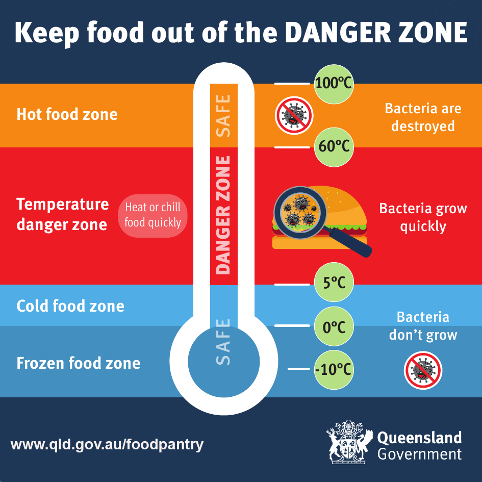

  

# **LIABILITY**

DISCLAIMER: the following only applies to the U.S. 

## **TLDR**

Here's a handy <a href="docs/liability_flowchart.pdf" target="_blank">**LIABILITY FLOW CHART** </a> that will get you started. 

Also please check out our friends at [the Freedge](https://freedge.org/)'s manifesto [the Liability Myth](https://drive.google.com/file/d/1O_44v7yoTkj3BIqw6SImhFrfygohMJgv/view) , that goes into detail about the stigma-perpetuating and non-profit-industrial-complex-supporting implications of all the below. 

For those who want to get in the nitty gritty... keep reading 

So you need to know that

## 1. **Getting sued for donating food is not a thing** 

This [report](https://law.uark.edu/documents/2013/06/Legal-Guide-To-Food-Recovery.pdf) by the University of Arkansas School of Law found that 

>"lawsuits arising out of
the donation or provision of recovered food are extremely uncommon. Indeed, **a thorough search of filings and review of reported decisions did not turn up a single case that involved food donation-related liability** or any attempts to get around the protections offered by the Bill Emerson Act. Additionally, several leading food recovery experts and antihunger advocates report that they are unaware of any such actual or threatened lawsuits. The absence of litigation or other disputes related to food donation demonstrates that fear of lawsuits or other negative publicity related to mishaps with donated food are overstated and largely illusory barriers to food recovery."

## 2. **You and your donors are protected under federal law... as long as you are a non-profit** 

If you're already a non-profit, the federal [**Bill Emerson Good Samaritan Food Donation Act**](https://www.feedingamerica.org/about-us/partners/become-a-product-partner/food-partners) is your best friend, and will keep you safe as long as you fulfill these 4 requirements: 

1. The donation must be
made to a nonprofit
organization.

2. The food must be donated to a nonprofit organization in good faith, meaning that the food must be donated with the honest belief that it is safe to eat

3. The donated items must be
either apparently wholesome
food or apparently fit grocery
products

4. The nonprofit organization that receives the donated food must distribute it to needy individuals, who must not pay anything of monetary value for the donated food

For more info: 

<a href="docs/Liability Protection Food Donation.pdf" target="_blank">Liability Protection Food Donation.</a>

### **Cool. I'm not a non-profit. Now what?** {#non-profit}

It's ok! You have options

#### 1. **You're probably fine anyway** (see point 1 above)

Also, seriously, you're fine if you're in certain states (like CA, CO), so it's worth looking at the specifics for your state. Also, good for you, for not being a part of this horrendous system :)  

#### 2. **Get a fiscal sponsor**

A fiscal sponsor is basically a 501(c)(3) non-profit that agrees to sponsor you such that you share their 501(c)(3) non-profit status. They also receive your money, so you'll have to send them a budget once a year (which can be $0). 

Relationships with fiscal sponsors may vary, but, luckily, we have a solution for you! 

Our fiscal sponsor, [Left Lovers](https://opencorporates.com/companies/us_ca/201718410104) (yes, it's a real non-profit, not a movie about sexy vampires or a marxist cell) is very happy to sponsor food recovery efforts without taking a chunk of your money. The only thing they might ask is a yearly insurance fee to cover your operation. If you're interested in being sponsored by Left Lovers, fill in [this fiscal sponsorship form](https://drive.google.com/file/d/1Dha31GaLD_fZ1qEfy21PBgq5owvEllJd/view) and contact ernst@freedge.org.

If Left Lovers sounds too much like a free-love anarchist commune for you, here's a [database of local fiscal sponsors](https://fiscalsponsordirectory.org/).

>"If you are interested in some of the different ways fiscal sponsorship can be done, Gregory Colvin and Stephanie Petit have a good summary of the [different types of fiscal sponsorships](https://www.adlercolvin.com/wp-content/uploads/2017/12/Fiscal-Sponorship-Six-Ways-To-Do-It-Right-A-Synopsis.pdf)" 

(paraphrased from [big door brigade](http://bigdoorbrigade.com/category/handling-money-and-taxes/))

#### 3. **Become a 501(c)(3) non-profit** 

Might be worth it depending on your needs, but i'm sure not gonna get into that here :) 

#### **COMPARE YOUR OPTIONS**

Here's a good comparison of your <a href="docs/non-profit-status.pdf" target="_blank">options for acquiring non-profit-status</a> from [big door brigade](http://bigdoorbrigade.com/category/handling-money-and-taxes/). 

You might have noticed me citing [big door brigade](http://bigdoorbrigade.com/category/handling-money-and-taxes/) twice in a row, and that's because it's a compilation of resources for mutual aid orgs that's worth checking out and because everything Dean Spade touches is gold. 

### **So you say i'm covered, but i have questions!** 

I know! This is complicated! 

Here are some [FAQs compiled by the USDA](https://www.usda.gov/sites/default/files/documents/usda-good-samaritan-faqs.pdf)

Keep reading for the biggies: 

#### **What kinds of donors are covered?**

This may vary by state, but usually it'll be everyone except private individuals, aka home kitchens. 

> “Persons,” “gleaners,” and “nonprofit organizations” all receive
protection from the Bill Emerson Act.
The very broad category of covered
persons embraces individuals,
corporations, partnerships,
organizations, associations or
governmental entities. It expressly
includes retail grocers, wholesalers,
hotels, motels, manufacturers,
restaurants, caterers, farmers, and
nonprofit food distributors or
hospitals. Protection from liability
extends to officers, directors,
partners, deacons, trustees, council
members, or other elected or
appointed individuals responsible for
governance of covered entities. 

(from UARK's [Legal Guide To Food Recovery](https://law.uark.edu/documents/2013/06/Legal-Guide-To-Food-Recovery.pdf))

#### **What food is covered?** 

Basically everything. 

> * **Field gleaning**: The collection of crops from farmers’
fields that have already been mechanically
harvested or from fields where it is not economically
profitable to harvest. Gleaning is also used to
describe the donation of raw agricultural products
that have already been harvested and are being
stored at a farm or packing house.

> * **Perishable produce rescue/salvage**: The collection
of perishable produce from wholesale and retail
sources, including wholesale markets, supermarkets,
and farmers’ markets.

> * **Perishable and prepared food rescue**: The collection
of prepared foods from the food service industry,
including restaurants, hospital, caterers, and
cafeterias.

> * **Nonperishable processed food collection**: The
collection of processed foods, usually with long shelf
lives, from sources such as manufacturers,
supermarkets, distributors, grocery stores, and food
drives.

(from UARK's [Legal Guide To Food Recovery](https://law.uark.edu/documents/2013/06/Legal-Guide-To-Food-Recovery.pdf))

#### **When am i liable?** 

Uuuuhm when you're a d*** and give people rotten food on purpose. 

In legalese: 

> The exemption from liability is not absolute. Acts or omissions constituting
“gross negligence” or “intentional misconduct” which result in the death or injury
of “an ultimate user or recipient” are not exempted. 

> Gross negligence: A “voluntary and conscious conduct (including a failure to act) by a person
who, at the time of the conduct, knew that the conduct was likely to be harmful
to the health or well-being of another person.” A finding of gross negligence requires consideration of several factors,
including: 

>  - The type of food involved

>  - The recommended sell by date: 
>The recommended sell by date alone should not be determinative; it must be considered in light of the type of food
involved.

> To understand how these first two factors are intended to operate,
consider the example of the donation of a box of cereal with that of milk or
chicken addressed in the House Report on the Bill Emerson Act. The “box of
cereal that is provided to a food pantry just before or even after the date of
retail sale would be perfectly safe for consumption, whereas a carton of milk or
container of fresh poultry that is donated just beyond the retail sales date could
be dangerous to a person’s health.”

> Intentional misconduct: a “conduct by a person with knowledge (at the time of the
conduct) that the conduct is harmful to the health or well-being of another
person.”

(from the [The Legal Guide to the Bill Emerson Good Samaritan Food Donation Act by James Haley](https://law.uark.edu/service-outreach/food-recovery-project/Legal-Guide-to-the-BEA-Haley-Final.pdf))

#### **What's the deal with expiration dates, best-by labels, etc?**

Even the [FDA says they're BS](https://www.fda.gov/consumers/consumer-updates/confused-date-labels-packaged-foods)

Basically ignore best-by dates, pay attention to use-by, but mostly use your senses, including common sense :) 

#### **What if the laws in my state say something different?**

Happily, it doesn't really matter if your state's laws suck more than the federal one because federal trumps state: 

> "The Department of Justice (DOJ) Office of Legal Counsel has interpreted the Act (Bill Emerson Act) as preempting state laws that provide less liability protection to donors. Under the DOJ’s interpretation, state laws may provide greater protection against liability, but not less."

(from [USDA FAQs](https://www.usda.gov/sites/default/files/documents/usda-good-samaritan-faqs.pdf))

Buuuuut, sometimes, your state's laws can help you out. like if they specifically protect you if you donate expired food directly to individuals (thanks CA!) . so it's worth checking out. 

## **State-specific laws** 

### All states 
slightly outdated LOL: <a href="docs/state_liability_protection.pdf" target="_blank">liability  protection by state (2017).</a> 

(from the Harvard Law School Food Law and Policy Clinic [Dont Waste Donate](https://www.chlpi.org/wp-content/uploads/2013/12/Dont-Waste-Donate_-March-2017.pdf))

### California

> On January 1, 2018, California enacted the
California Good Samaritan Food Donation
Act (AB 1219), which provides liability
protections for entities that make good faith
donations of surplus food. The law clarifies
and expands liability protections for donated
surplus food by:

>* Explicitly stating  that **donation of past-date
food is subject to liability protection**

>* Expanding liability protection to donations
made by food facilities, which are subject
to food safety regulations and regular
inspections, **directly to individuals for
consumption (direct donation).**

(from [LA Guidance for Food Operators](http://publichealth.lacounty.gov/eh/docs/LACFRI_FoodOperatorGuidance-en.pdf))

[CA food donation laws](https://www.cdph.ca.gov/Programs/CEH/DFDCS/CDPH%20Document%20Library/FDB/FoodSafetyProgram/FoodDonations.pdf)

### Washington State

[WA food donation rules](https://www.doh.wa.gov/communityandenvironment/food/foodworkerandindustry/charityfooddonations)

  

# **PERMITS**

Ok great! Now we got all scary liability stuff out of the way, you want to start giving away some food! So if your goal is to keep things legal, you're going to need spme permits. 

This stuff varies a lot by state, so it may take some figuring out, but I'm going to walk through what you need in CA:

## FOOD OPERATION/ HEALTH PERMIT 

The health permit you need is going to depend on: 

* The type of food you're going to be dealing with: 
        
  - perishable (ex: meat, dairy, cooked meals)

    
  - non-perishable (cans, bread)

  - produce (fruits, vegeables, nuts)  
  
* What you're going to do with that food: storing, portioning, reheating, cooking... 

 

The Night Market recovers food from restaurants and other eateries so: 

* you'll be dealing with perishable food (cooked meals) as well as non-perishables and produce

* you'll often have to do same day storage and portion out the food into individual containers. 

You will have to go to your local county web page, usually under environmental health or food safety, and find the application form for a food operation or equivalent permit. 

### California: **LSCFO - DOS AND DON'TS**

> In CA, as of 2019 there's a new category of food operation called LSCFO thanks to Assembly Bill (AB) 2178, which "defined a **limited service charitable feeding operation (LSCFO**) as a nonprofit charitable organization that provides food service to a consumer solely for providing charit and exempts LSCFO from the definition of a food facility." 

(from https://www.sfdph.org/dph/EH/Food/lscfo.asp)

Everyone loves a good flowchart. Here is the <a href="docs/LSCFO_flowchart.pdf" target="_blank">LSCFO flow chart </a> that will get you started. 

At our Night Market, because we deal with perishables and commercially prepared foods that we portion out ourselves that we redistribute on the same day, and we are not partnered with a food bank, we are registered as a **LSCFO category 3**. 

#### **How do I register?**

* Fill in your local county LSCFO application. 
This is the information you'll have to provide

  - Name, physical address, internet website, and telephone number of the nonprofit charitable organization conducting the LSCFO.
  - Name and contact information of a site representative of the LSCFO.
  - Operating days and hours of the LSCFO.
  
* Pay a fee. 
Yep. It's around $200. 

#### **Do we need food safety training?**

Nope, it's not required, you just need to follow Best Management practices (BMP). Here's a summary of those provided by our own Yolo County (<a href="docs/LSCFO_flowchart.pdf" target="_blank">BMP </a>), but I'm going to go over the key aspects below. 

#### **Where can food be served?** 

* At the LSCFO facility 

* Outdoors **for up to 4h a day**. For this you'll need a permit with the local city parks department or equivalent (see below)

#### **What food can be served?** 

Everything (including expired food) 

**Exceptions** 

* Cooked food from unregistered home kitchens
  - "microenterprise" home kitchens are allowed (see [Foodnome](https://foodnome.com/))
  - commercially pre-packaged foods, baked goods are allowed.

* Salvage operations (So i guess no dumpster diving treasures :( ) 

* Expired baby food and infant formula. 

#### **Equipment, utensils, food containers** 
Must be food-grade

#### **Food storage**

THIS IS IMPORTANT !!!

* All food

  - at least six inches off the floor or on a pallet
  - not be stored in restrooms or garages
  - raw produce should be stored below ready-to-eat foods to prevent accidental cross-contamination.
  
  
* **Potentially hazardous food (PHF)**: (i.e., deli meats, dairy products, cooked meats, cooked rice, cooked vegetables, etc.) are perishable and must be kept at 41°F or below.  They can leave cold storage for: 

  - up to 30 minutes for transport
  - up to 2 hours for active preparation or portioning
  - up to 4 hours at a time in total. **After 4h they should be served immediately or dumped.**
  

  
 
A permanently affixed thermometer in cold holding equipment used for PHFs should be readily visible and placed in the warmest part of each refrigeration unit.

 
 

#### **How to serve food**

* Hair must be contained
* Food must be covered and protected 
* Portioning food: use food-grade utensils, portion into food-grade containers and label them
* If food has been served to someone, it can't be returned and served to someone else 
* Use commercial-grade hand sanitizer or a handwash station to wash hands previously 

Basically what this means is that you'll have to keep an eye out to make sure people don't open boxes and then leave them there, as those boxes are theoretically not fit for human consumption anymore. 

## EVENT PERMIT

You will have to go to your local city web page, usually under Parks and Rec, and find the application form for an event or space reservation permit. 

It will look something like this: [Application Fields and Picnic](https://www.cityofdavis.org/home/showpublisheddocument/16217/637641194986770000)

  

# **TAX DEDUCTIONS**

Wow ok, you're ready to go to start donating food!! The last thing we're going to talk about is the cherry on top for some businesses, which is that they get tax deductions for donating stuff, and people loooooove not paying taxes. So if you want to potentially attract some donors this way, here's how to do it. 

### Requirements for you to receive donations

1)  You have to be a non-profit. 

Yep. To offer tax deductions to any business you're going to have to have 501(c)(3) non profit status, so that means either you've done the paperwork to become one, or you're fiscally sponsored by one (see previous section [i'm not a non-profit](#non-profit))

2) Your non-profit must serve the needy

3) Your non-profit must not charge money

### What you have to provide the donor

You should be able to provide to the donating business a statement with the following: 

1) a description of the donated food, with the date
2) a statement that it'll be used 1) by a non-profit that 2) serves the needy and 3) does not charge money. 
3) a statement that you're a tax-exempt non-profit (under federal I.R.C 501(c)(3) (yeah idk what that means either)) and you'll have to provide the tax-exempt identification number (it should look something like this:  [affidavit for exemption](https://www.yolocounty.org/home/showdocument?id=21188))
4) a statement that adequate records will be kept and made available to the IRS upon request. 
  
As the people who are receiving the donation, that's all you gotta know, the donor can figure out the rest (aka how much taxes they don't have to pay).

### For more info

[Legal Guide: Tax Deduction for Food Donation](https://www.chlpi.org/wp-content/uploads/2013/12/Food-Donation-Fed-Tax-Guide-for-Pub-2.pdf)

# RESOURCES

Useful resources that were used to compile this guide. 

[Freedge Yourself](https://freedge.org/freedge-yourself/)

[Big Door Brigade](http://bigdoorbrigade.com/category/handling-money-and-taxes/)

[Bill Emerson Good Samaritan Food Donation Act](https://www.feedingamerica.org/about-us/partners/become-a-product-partner/food-partners)

[FAQs compiled by the USDA about the Bill Emerson Good Samaritan Food Donation Act](https://www.usda.gov/sites/default/files/documents/usda-good-samaritan-faqs.pdf)

UARK's [Legal Guide To Food Recovery](https://law.uark.edu/documents/2013/06/Legal-Guide-To-Food-Recovery.pdf)

[The Legal Guide to the Bill Emerson Good Samaritan Food Donation Act by James Haley](https://law.uark.edu/service-outreach/food-recovery-project/Legal-Guide-to-the-BEA-Haley-Final.pdf)

the Harvard Law School Food Law and Policy Clinic [Dont Waste Donate](https://www.chlpi.org/wp-content/uploads/2013/12/Dont-Waste-Donate_-March-2017.pdf)

[FDA: consumer confusion with food labels](https://www.fda.gov/consumers/consumer-updates/confused-date-labels-packaged-foods)

[LA Guidance for Food Operators](http://publichealth.lacounty.gov/eh/docs/LACFRI_FoodOperatorGuidance-en.pdf)

[WA food donation rules](https://www.doh.wa.gov/communityandenvironment/food/foodworkerandindustry/charityfooddonations)

<a href="docs/LSCFO_YOLO.pdf" target="_blank">LSCFO YOLO county </a>

[Legal Guide: Tax Deduction for Food Donation](https://www.chlpi.org/wp-content/uploads/2013/12/Food-Donation-Fed-Tax-Guide-for-Pub-2.pdf)

